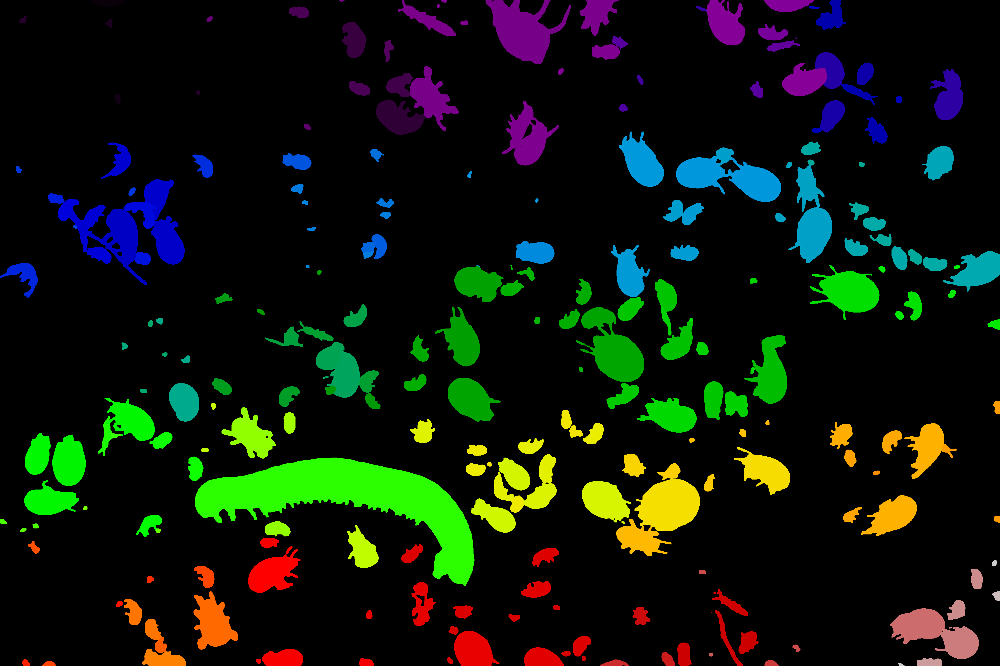
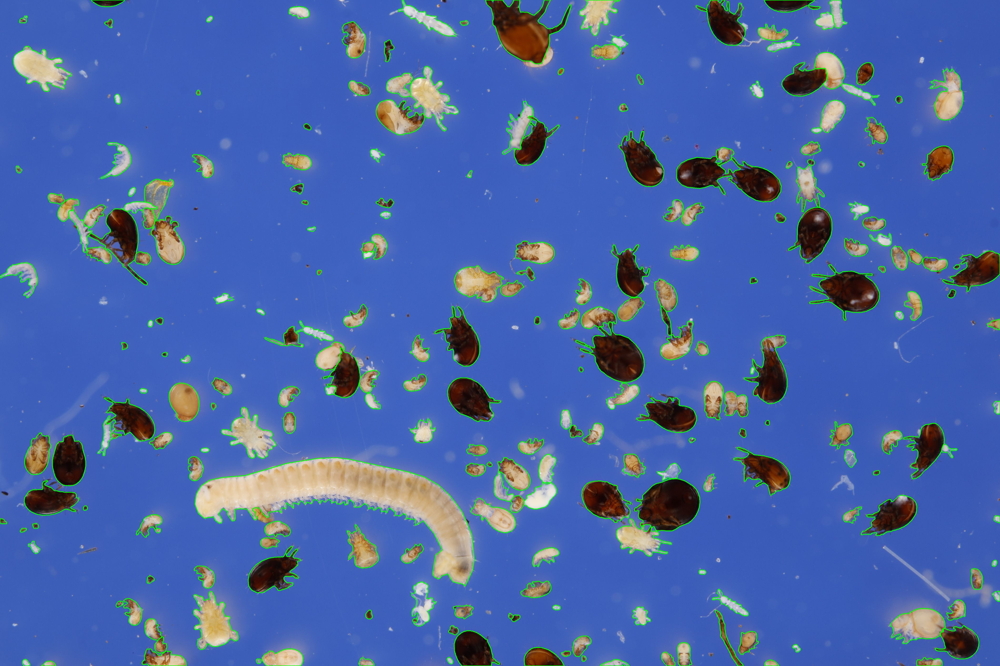

# sfai
UNINE Master Thesis Project

sfai is a CLI tool split into different subtool:

- Automatic segmentation
- COCO to Biigle converter
- Recursive file copy utility

The segmentation gives the following results:

   

## Quick Start

### Install the sfai tool
1. Clone the [repo](https://github.com/RobinDanz/sfai):

```
git clone https://github.com/RobinDanz/sfai.git
```

2. Navigate into the `sfai` folder:

```
cd sfai
```

3. Install the tool as a pip package:

```
pip install .
```

### CUDA support
The tool supports CUDA. To run segmentation on the GPU follow the steps below.

1. Uninstall current torch & torchvison package:

```
pip uninstall torch torchvision
```

2. Install CUDA-compatible torch version:

```
pip install torch torchvision --index-url https://download.pytorch.org/whl/cu126
```

The version depends on your GPU and installed CUDA version. Check the exact command on the [PyTorch website](https://pytorch.org/get-started/locally/).

## Usage
### Segmentation
```sh
sfai segment --help

usage: sfai segment [-h] -c CONFIG

options:
  -h, --help            show this help message and exit
  -c CONFIG, --config CONFIG
                        Config file
```

Example with a config file: 
```sh
sfai segment -c /path/to/config.yaml
```


#### Configuration
* `segment` (string): The top level of the segmentation configuration
* `output_dir` (string): Where to save the files.
* `name` (string): The run name. This directory will be created into the `output_dir`. if it does not exist.
* `model` (string): The path to a SAM model. The model will be downloaded if it is not found.
* `save_intermediate_images` (bool): If true, saves step for each tile of the input images. Generating thoses images slows the process down.
* `save_final_images` (bool): If true, saves the final images with the segmentation results. It saves the mask and the polygones.
* `datasets` (list[string]): List of paths to the images to segment. The path can either be a folder or a single image.

#### Output
The segmentation works in a "run" fashion. For each run with the same `name`, a folder with a number will be created into the `output_dir/name` directory. That folder will contain the output files: images, crops and annotations files.

The generated annotations files are in COCO format. The images and the annotations are also written in a separated JSONL file in the same folder.

#### Run on the samples
1. Rename the `config.example.yaml` to `config.yaml`
2. Edit the file:

* Set the `output_dir` variable.
* Optionnaly set an `output_name`. This will be the name of the folder inside of the `output_dir`.
* Set `save_intermediate_images` to check the different steps.
* Set `save_final_images` to generate an image of the final results.
* Add `/path/to/sfai/samples/` to the `datasets`.
* Run the tool: `sfai segment -c config.yaml`

### COCO to Biigle converter

```sh
sfai coco2biigle --help

usage: sfai coco2biigle [-h] -c COCO -t LABEL_TREE_PATH [-o OUT_DIR] [-p PROJECT_NAME] [-v VOLUME_NAME]

options:
  -h, --help            show this help message and exit
  -c COCO, --coco COCO  Path to a coco file.
  -t LABEL_TREE_PATH, --label_tree_path LABEL_TREE_PATH
                        Path to a Biigle Label Tree zip file.
  -o OUT_DIR, --out_dir OUT_DIR
                        Output path. Default: Current directory (C:\DEV\sfai\results\coco2biigle)
  -p PROJECT_NAME, --project_name PROJECT_NAME
                        Output project name. Default: project01
  -v VOLUME_NAME, --volume_name VOLUME_NAME
                        Output volume name. Default: volume01
```

Example to create a BIIGLE volume in the current directory.

```sh
sfai coco2biigle -c annotaions.json -t label_tree.zip
```


### File copy utility

Allows to copy or move files from multiple subdirectories into a single directory.

```sh
sfai cpfiles --help

usage: sfai cpfiles [-h] -s SOURCE -d DEST [-m] [-e [EXTENSIONS ...]]

options:
  -h, --help            show this help message and exit
  -s SOURCE, --source SOURCE
                        Source folder. Subfolders will be explored
  -d DEST, --dest DEST  Destination folder.
  -m, --move            Move files instead copy
  -e [EXTENSIONS ...], --extensions [EXTENSIONS ...]
                        File extensions
```

Example:

```sh
sfai cpfiles -s ./test/ -d ./newfolder/ -m
```

This command will move files from test folder to newfolder. Newfolder si created if it does not exist.


